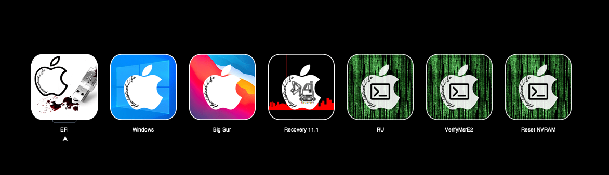
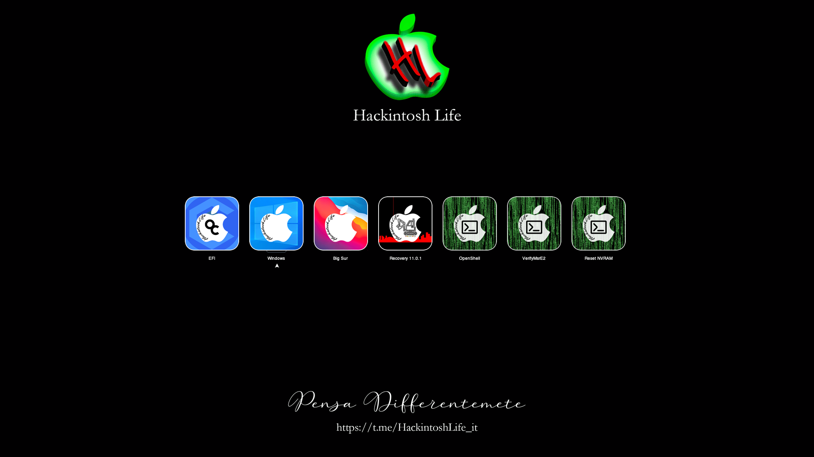

### HackintoshLife-Theme(for-OpenCore)-Wallpaper

## Wallpapers

In this section you will find various wallpapers divided by resolution.
How to use them: Download your favorite according to the resolution of your monitor, unzip the ZIP and insert the .icns file in EFI / OC / Resourse / Image

See [Download](https://github.com/Hackintoshlifeit/OC-Theme-HackintoshLife/blob/master/Wallpaper/fullhdchitarra.zip)

# If you need help please contact us on [Telegram](https://t.me/HackintoshLife_it) or [Web](https://www.hackintoshlife.it/)
