### HackintoshLife-Theme(for-OpenCore)-Wallpaper

Wallpapers

SeeHDready [Download](https://github.com/Hackintoshlifeit/OC-Theme-HackintoshLife/blob/master/Wallpaper/hdready/piratihdready.png)
SeeFullHD  [Download](https://github.com/Hackintoshlifeit/OC-Theme-HackintoshLife/blob/master/Wallpaper/Fullhd/piratifullhd.png)
See4k      [Download](https://github.com/Hackintoshlifeit/OC-Theme-HackintoshLife/blob/master/Wallpaper/4k/pirati4k.png)

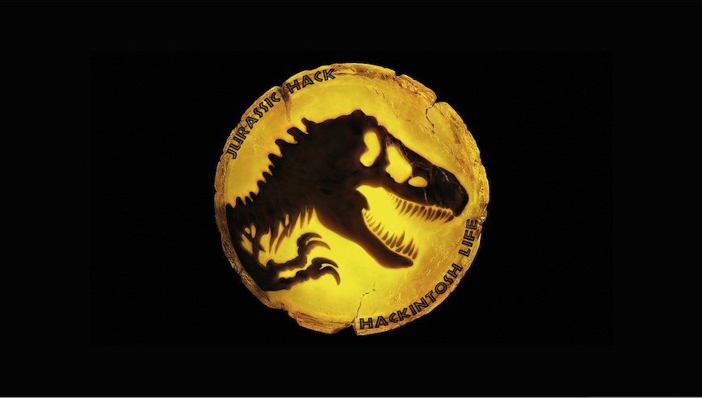

SeeHDready [Download](https://github.com/Hackintoshlifeit/OC-Theme-HackintoshLife/blob/master/Wallpaper/hdready/jurassichdready.png)
SeeFullHD  [Download](https://github.com/Hackintoshlifeit/OC-Theme-HackintoshLife/blob/master/Wallpaper/Fullhd/jurassicfullhd.png)
See2k      [Download](https://github.com/Hackintoshlifeit/OC-Theme-HackintoshLife/blob/master/Wallpaper/2k/jurassic2k.png)
See4k      [Download](https://github.com/Hackintoshlifeit/OC-Theme-HackintoshLife/blob/master/Wallpaper/4k/jurassic4k.png)

SeeHDready [Download](https://github.com/Hackintoshlifeit/OC-Theme-HackintoshLife/blob/master/Wallpaper/hdready/coffehdready.png)
SeeFullHD  [Download](https://github.com/Hackintoshlifeit/OC-Theme-HackintoshLife/blob/master/Wallpaper/Fullhd/coffefullhd.png)
See2k      [Download](https://github.com/Hackintoshlifeit/OC-Theme-HackintoshLife/blob/master/Wallpaper/2k/coffe2k.png)
See4k      [Download](https://github.com/Hackintoshlifeit/OC-Theme-HackintoshLife/blob/master/Wallpaper/4k/coffe4k.png)

SeeHDready [Download](https://github.com/Hackintoshlifeit/OC-Theme-HackintoshLife/blob/master/Wallpaper/hdready/gradientehdready.png)
SeeFullHD  [Download](https://github.com/Hackintoshlifeit/OC-Theme-HackintoshLife/blob/master/Wallpaper/Fullhd/gradientefullhd.png)
See2k      [Download](https://github.com/Hackintoshlifeit/OC-Theme-HackintoshLife/blob/master/Wallpaper/2k/gradiente2k.png)
See4k      [Download](https://github.com/Hackintoshlifeit/OC-Theme-HackintoshLife/blob/master/Wallpaper/4k/gradiente4k.png)

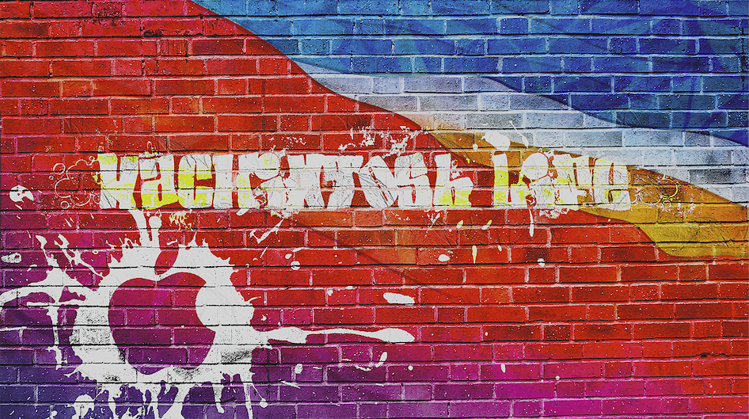

SeeFullHD  [Download](https://github.com/Hackintoshlifeit/OC-Theme-HackintoshLife/blob/master/Wallpaper/Fullhd/Wallpaper%20Graffiti.png)

SeeFullHD  [Download](https://github.com/Hackintoshlifeit/OC-Theme-HackintoshLife/blob/master/Wallpaper/Fullhd/fullhdrocce.png)

SeeFullHD  [Download](https://github.com/Hackintoshlifeit/OC-Theme-HackintoshLife/blob/master/Wallpaper/Fullhd/Wall%20Red.png)

SeeFullHD  [Download](https://github.com/Hackintoshlifeit/OC-Theme-HackintoshLife/blob/master/Wallpaper/Fullhd/Wall%20Green.png)

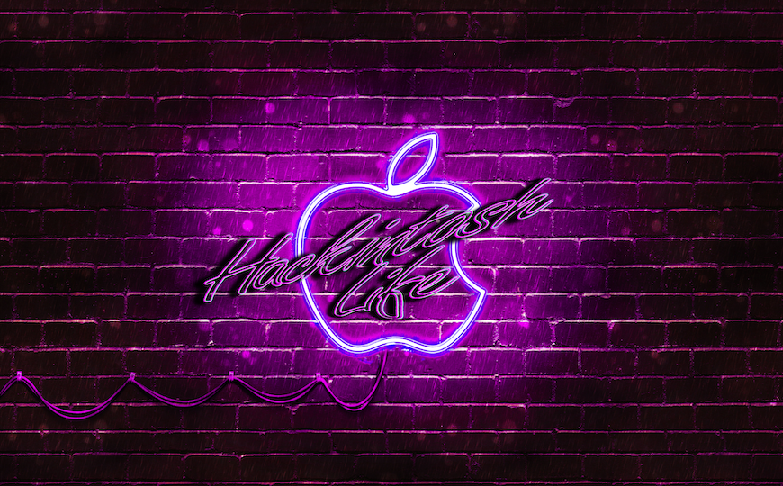

SeeFullHD  [Download](https://github.com/Hackintoshlifeit/OC-Theme-HackintoshLife/blob/master/Wallpaper/Fullhd/Wall%20Viola_.png)

## Iconset and Background for GUI OpenCore Default, Modern and Old

STANDARD RESOUCES OF HACKINTOSH LIFE:

Background Standard

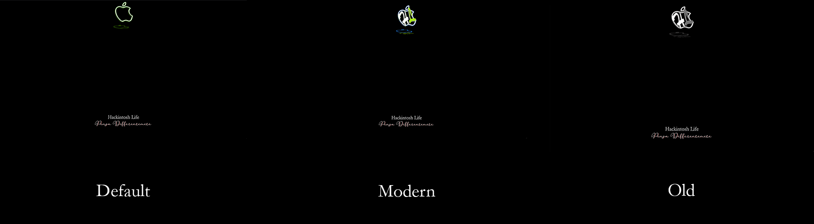

Default 

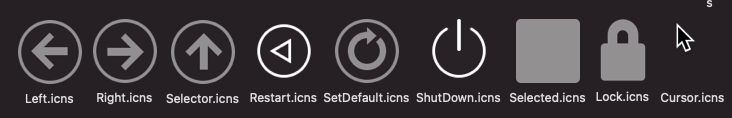

Modern

Old

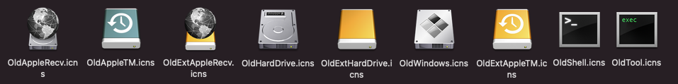

## BACKGROUND
If you want personalized background, In this section you will find various divided by resolution.
How to use them Download your favorite according to the resolution of your monitor, 
unzip the ZIP and overwrite folder resource in EFI/OC

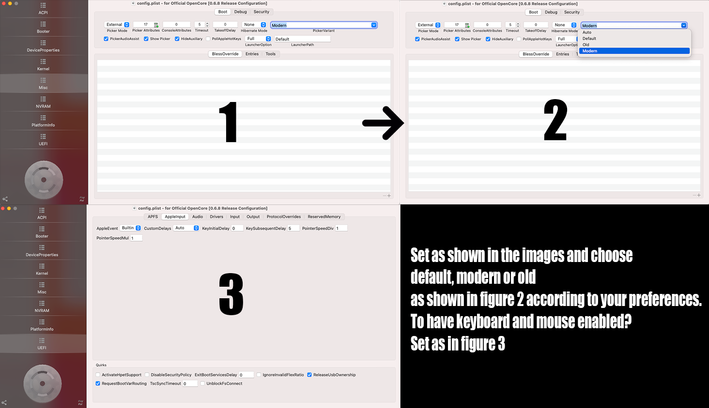

STANDARD

hdReady Resource [Download](https://github.com/Hackintoshlifeit/OC-Theme-HackintoshLife/blob/master/Resources/Resources%20hdready.zip)

fhd     Resource [Download](https://github.com/Hackintoshlifeit/OC-Theme-HackintoshLife/blob/master/Resources/Resources%20fhd.zip)

2k      Resource [Download](https://github.com/Hackintoshlifeit/OC-Theme-HackintoshLife/blob/master/Resources/Resources%202k.zip)

4k      Resource [Download](https://github.com/Hackintoshlifeit/OC-Theme-HackintoshLife/blob/master/Resources/Resources%204k.zip)

Skull Resource:

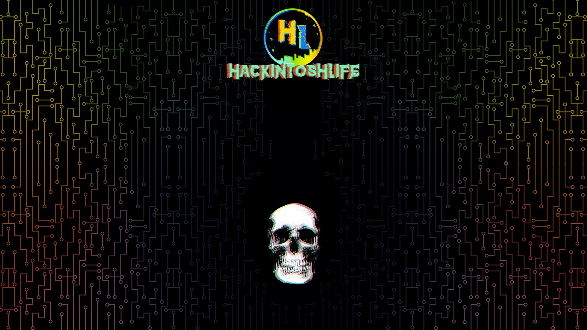

hdReady Resource [Download](https://github.com/Hackintoshlifeit/OC-Theme-HackintoshLife/blob/master/Resources/Resources_Gigabyte_hdready.zip)
fhd     Resource [Download](https://github.com/Hackintoshlifeit/OC-Theme-HackintoshLife/blob/master/Resources/Resources%20SkullFullHD.zip)
2k      Resource [Download](https://github.com/Hackintoshlifeit/OC-Theme-HackintoshLife/blob/master/Resources/Resources_Gigabyte_2k.zip)
4k      Resource [Download](https://github.com/Hackintoshlifeit/OC-Theme-HackintoshLife/blob/master/Resources/Resources%20Skull4k.zip)

GIGABYTE Resource:

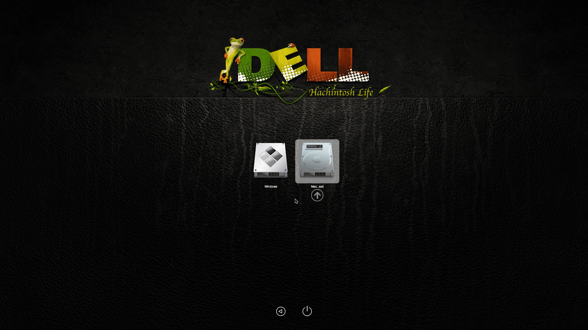

hdReady Resource [Download](https://github.com/Hackintoshlifeit/OC-Theme-HackintoshLife/blob/master/Resources/dellhdready.zip)
fhd     Resource [Download](https://github.com/Hackintoshlifeit/OC-Theme-HackintoshLife/blob/master/Resources/dellfullhd.zip)
2k      Resource [Download](https://github.com/Hackintoshlifeit/OC-Theme-HackintoshLife/blob/master/Resources/dell2k.zip)

GIGABYTE Resource:

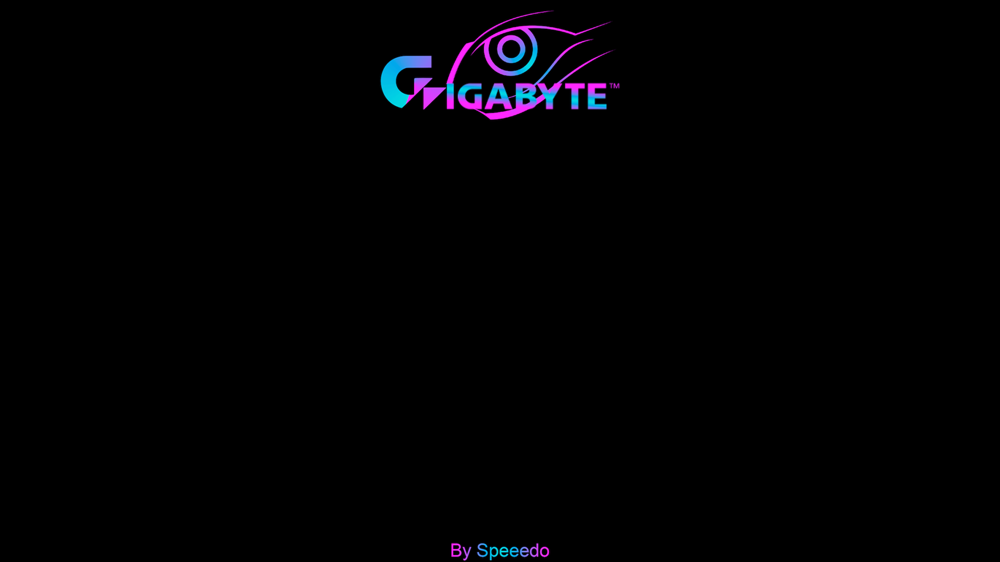

hdReady Resource [Download](https://github.com/Hackintoshlifeit/OC-Theme-HackintoshLife/blob/master/Resources/Resources%20SkullHD%20Ready.zip)
fhd     Resource [Download](https://github.com/Hackintoshlifeit/OC-Theme-HackintoshLife/blob/master/Resources/Resources_Gigabyte_fullhd.zip)
2k      Resource [Download](https://github.com/Hackintoshlifeit/OC-Theme-HackintoshLife/blob/master/Resources/Resources%20Skull2k.zip)
4k      Resource [Download](https://github.com/Hackintoshlifeit/OC-Theme-HackintoshLife/blob/master/Resources/Resources_Gigabyte_4k.zip)

NUC intel Resource:

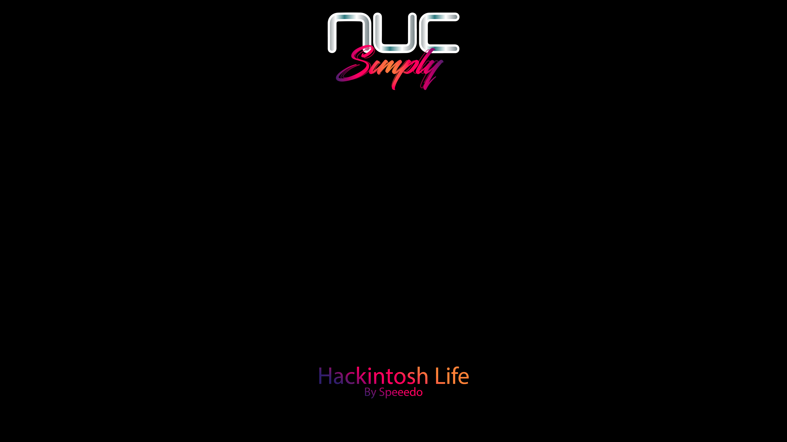

hdReady Resource [Download](https://github.com/Hackintoshlifeit/OC-Theme-HackintoshLife/blob/master/Resources/Resources_nuc_hdready.zip)
fhd     Resource [Download](https://github.com/Hackintoshlifeit/OC-Theme-HackintoshLife/blob/master/Resources/Resources_nuc_fullhd.zip)
2k      Resource [Download](https://github.com/Hackintoshlifeit/OC-Theme-HackintoshLife/blob/master/Resources/Resources_nuc_2k.zip)
4k      Resource [Download](https://github.com/Hackintoshlifeit/OC-Theme-HackintoshLife/blob/master/Resources/Resources_nuc_4k.zip)

ASUS Resource:

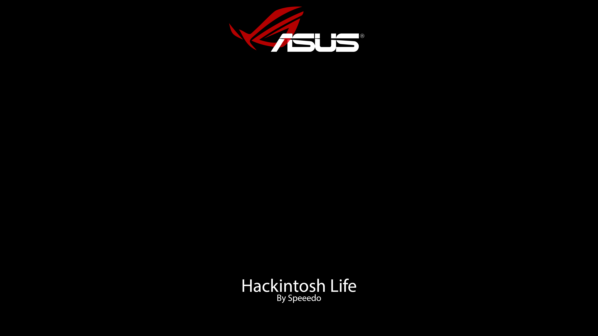

hdReady Resource [Download](https://github.com/Hackintoshlifeit/OC-Theme-HackintoshLife/blob/master/Resources/Resources_Asus_hdready.zip)
fhd     Resource [Download](https://github.com/Hackintoshlifeit/OC-Theme-HackintoshLife/blob/master/Resources/Resources_Asus_fullhd.zip)
2k      Resource [Download](https://github.com/Hackintoshlifeit/OC-Theme-HackintoshLife/blob/master/Resources/Resources_Asus_2k.zip)
4k      Resource [Download](https://github.com/Hackintoshlifeit/OC-Theme-HackintoshLife/blob/master/Resources/Resources_Asus_4k.zip)

ACER Resource:

hdReady Resource [Download](https://github.com/Hackintoshlifeit/OC-Theme-HackintoshLife/blob/master/Resources/Resources_Acer_hdready.zip)
fhd     Resource [Download](https://github.com/Hackintoshlifeit/OC-Theme-HackintoshLife/blob/master/Resources/Resources_Acer_fullhd.zip)
2k      Resource [Download](https://github.com/Hackintoshlifeit/OC-Theme-HackintoshLife/blob/master/Resources/Resources_Acer_2k.zip)
4k      Resource [Download](https://github.com/Hackintoshlifeit/OC-Theme-HackintoshLife/blob/master/Resources/Resources_Acer_4k.zip)

