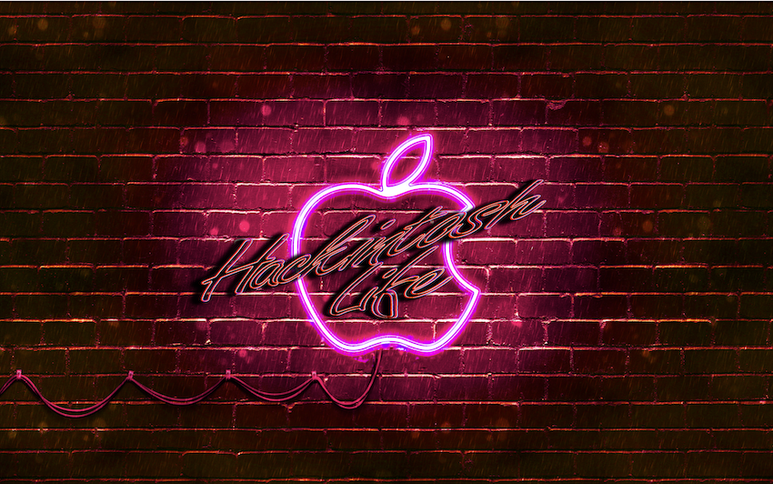
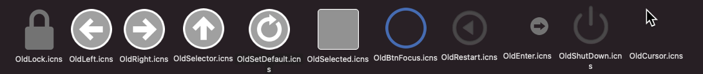

### HackintoshLife-Theme(for-OpenCore)-Wallpaper

##Walpapers

Wallpapers

See HD ready [Download](https://github.com/Hackintoshlifeit/OC-Theme-HackintoshLife/blob/master/Wallpaper/hdready/piratihdready.png)
See FullHD [Download](https://github.com/Hackintoshlifeit/OC-Theme-HackintoshLife/blob/master/Wallpaper/Fullhd/piratifullhd.png)
See 4k [Download](https://github.com/Hackintoshlifeit/OC-Theme-HackintoshLife/blob/master/Wallpaper/4k/pirati4k.png)

See HD ready [Download](https://github.com/Hackintoshlifeit/OC-Theme-HackintoshLife/blob/master/Wallpaper/hdready/jurassichdready.png)
See FullHD [Download](https://github.com/Hackintoshlifeit/OC-Theme-HackintoshLife/blob/master/Wallpaper/Fullhd/jurassicfullhd.png)
See 2k [Download](https://github.com/Hackintoshlifeit/OC-Theme-HackintoshLife/blob/master/Wallpaper/2k/jurassic2k.png)
See 4k [Download](https://github.com/Hackintoshlifeit/OC-Theme-HackintoshLife/blob/master/Wallpaper/4k/jurassic4k.png)

See HD ready [Download](https://github.com/Hackintoshlifeit/OC-Theme-HackintoshLife/blob/master/Wallpaper/hdready/coffehdready.png)
See FullHD [Download](https://github.com/Hackintoshlifeit/OC-Theme-HackintoshLife/blob/master/Wallpaper/Fullhd/coffefullhd.png)
See 2k [Download](https://github.com/Hackintoshlifeit/OC-Theme-HackintoshLife/blob/master/Wallpaper/2k/coffe2k.png)
See 4k [Download](https://github.com/Hackintoshlifeit/OC-Theme-HackintoshLife/blob/master/Wallpaper/4k/coffe4k.png)

See HD ready [Download](https://github.com/Hackintoshlifeit/OC-Theme-HackintoshLife/blob/master/Wallpaper/hdready/gradientehdready.png)
See FullHD [Download](https://github.com/Hackintoshlifeit/OC-Theme-HackintoshLife/blob/master/Wallpaper/Fullhd/gradientefullhd.png)
See 2k [Download](https://github.com/Hackintoshlifeit/OC-Theme-HackintoshLife/blob/master/Wallpaper/2k/gradiente2k.png)
See 4k [Download](https://github.com/Hackintoshlifeit/OC-Theme-HackintoshLife/blob/master/Wallpaper/4k/gradiente4k.png)

See FullHD [Download](https://github.com/Hackintoshlifeit/OC-Theme-HackintoshLife/blob/master/Wallpaper/Fullhd/Wallpaper%20Graffiti.png)

See FullHD [Download](https://github.com/Hackintoshlifeit/OC-Theme-HackintoshLife/blob/master/Wallpaper/Fullhd/fullhdrocce.png)

See FullHD [Download](https://github.com/Hackintoshlifeit/OC-Theme-HackintoshLife/blob/master/Wallpaper/Fullhd/Wall%20Red.png)

See FullHD [Download](https://github.com/Hackintoshlifeit/OC-Theme-HackintoshLife/blob/master/Wallpaper/Fullhd/Wall%20Green.png)

See FullHD [Download](https://github.com/Hackintoshlifeit/OC-Theme-HackintoshLife/blob/master/Wallpaper/Fullhd/Wall%20Viola_.png)

## Iconset and Background for GUI OpenCore Default, Modern and Old

STANDARD RESOUCES OF HACKINTOSH LIFE:

Background Standard

Default 

Modern

Old

## BACKGROUND
If you want personalized background, In this section you will find various divided by resolution.
How to use them Download your favorite according to the resolution of your monitor, unzip the ZIP and insert the .icns file in EFI / OC / Resources / Image
